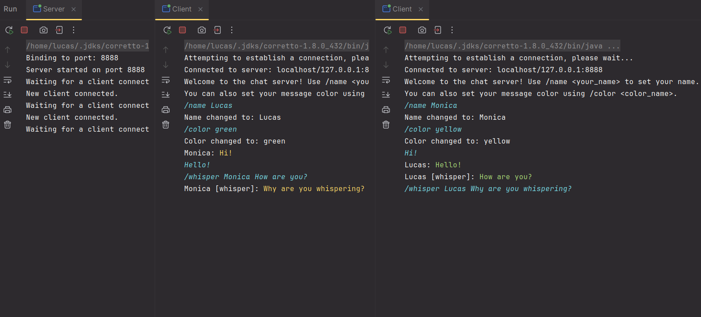

# Chat Server and Client (Java)

This repository contains a simple chat server and client application implemented in Java.  The server handles multiple clients concurrently, allowing them to chat with each other.

## Features

* **Multi-user Chat:** Multiple clients can connect and interact with each other.
* **Private Messaging (Whispers):** Users can send private messages to other users.
* **Usernames:** Clients can set their own usernames to identify themselves in the chat.
* **Color Support:** Clients can customize their message colors for better visibility.
* **Server-side Command Handling:** The server recognizes commands like `/name`, `/whisper`, and `/color` to manage user settings.

## Code Explanation

**Server (`Server.java`)**

* **Server Class:**
    * Creates a server socket that listens for client connections on a specified port.
    * Accepts incoming connections and creates new `ServerWorker` threads for each client.
    * Maintains a list of connected clients and their names.
    * Implements methods for broadcasting messages to all clients and sending private messages to individual clients.
* **ServerWorker Class:**
    * Handles communication with a single client in a separate thread.
    * Creates input and output streams to communicate with the client.
    * Handles user input, including commands like `/name`, `/whisper`, and `/color`.
    * Broadcasts messages from the client to other connected users.
    * Handles client disconnections and updates the server's client list.

**Client (`Client.java`)**

* **Client Class:**
    * Establishes a socket connection to the server.
    * Creates input and output streams to communicate with the server.
    * Reads user input from the console and sends messages to the server.
    * Receives and displays messages from the server in a separate thread.
    * Handles the `/quit` command to end the chat.

## Picture

## Notes

* The server assumes a single server instance.
* The client should be run in a separate terminal or command prompt from the server.
* This code demonstrates a basic chat functionality and can be further expanded with features like file sharing, user authentication, and more.

## Tags

- java
- chat
- server
- client
- networking
- socket
- multi-user
- private messaging
- username
- color
- command handling
